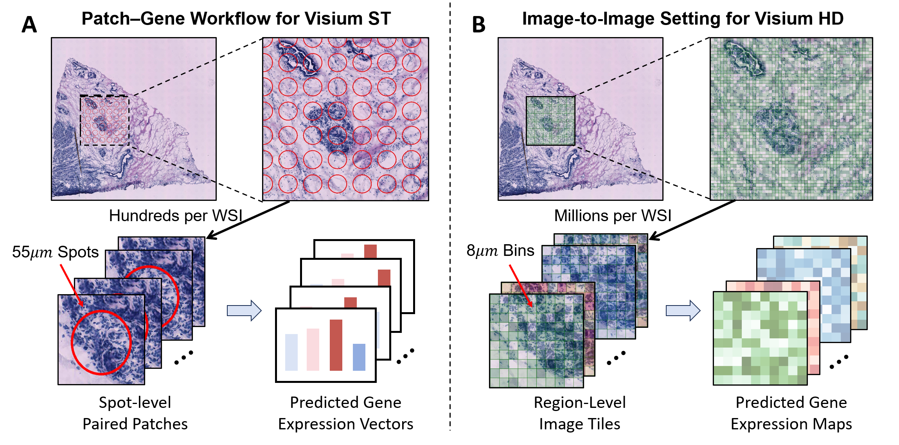
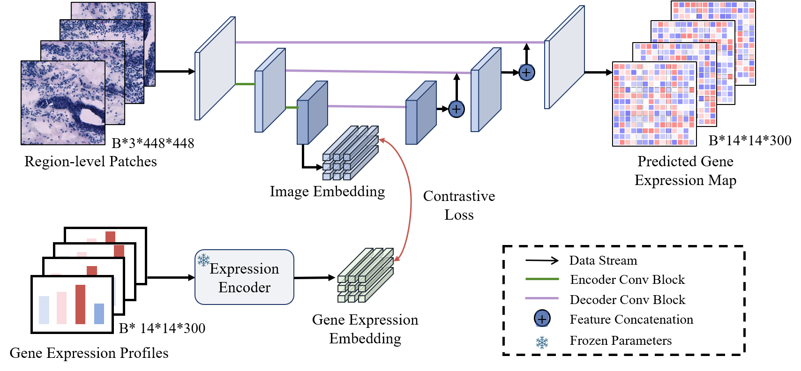

# Img2ST-Net
Img2ST-Net: Efficient High-Resolution Spatial Transcriptomics Prediction from Histology via a Fully Convolutional Image-to-Image Approach



**Modeling paradigm for spatial transcriptomics prediction：** (A) Conventional patch-to-spot regression manner for Visium ST data: each WSI contains hundreds of 55um spots for the ST slide. A separate gene expression vector is predicted for each spot from its corresponding image patch. (B) Our proposed image-to-image prediction framework for Visium HD data: each WSI contains millions of 8um  bins for the HD slide. A region-wise modeling strategy where each image region covers multiple bins is used to predict a high-resolution gene expression map, which enables more fine-grained and computationally efficient inference.

## Overall Framework



**Overall framework of our proposed Img2ST-Net:** Fig 2: Overall framework of our proposed Img2ST-Net. Region-level histological patches are processed through a UNet-based architecture to predict high-resolution gene expression maps. Simultaneously, regional gene expression profiles are encoded into embeddings using a frozen expression encoder. A contrastive loss aligns these embeddings with intermediate image features, facilitating accurate and efficient spatial gene expression prediction.

## Environment Setup

We recommend using [conda](https://docs.conda.io/en/latest/) to manage the environment.

```bash
# create a new environment
conda create -n stpred python=3.9 -y
conda activate stpred

# install dependencies
pip install -r requirements.txt
```

## Dataset Preparation

Organize the dataset directory as follows:

```
datasets/
  ├── BC/
  │   ├── raw_setting/
  │      └── A.npy
  │   └── data_infor/
  │      └── A.npy
  │   └── cropped_img/
  └── CRC/
```

Each dataset should contain the preprocessed `.npy` files required by the dataloader.

## Running Example

Single-GPU example

```
python main.py \
  --root_path ./datasets/BC \
  --exp_name test_run \
  --epochs 2 \
  --batch_size 4 \
  --test_slide D.npy \
  --bin_num 1
```

Multi-GPU example

```
torchrun --nproc_per_node=2 main.py \
  --root_path ./datasets/BC \
  --exp_name test_run_ddp \
  --epochs 2 \
  --batch_size 4 \
  --test_slide D.npy \
  --bin_num 1
```

